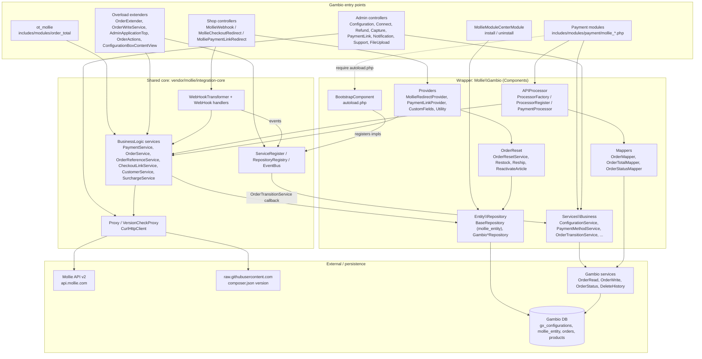
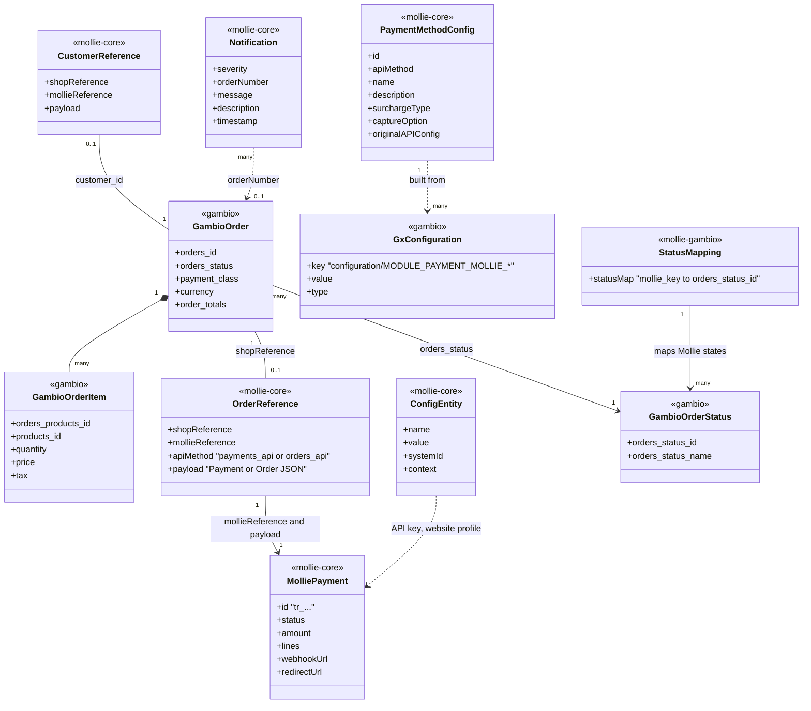
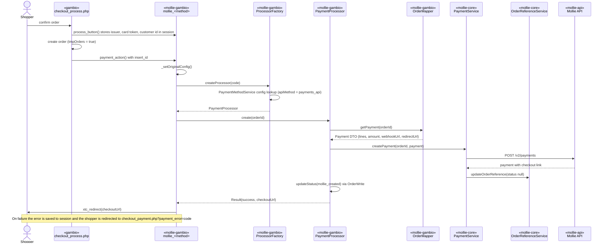
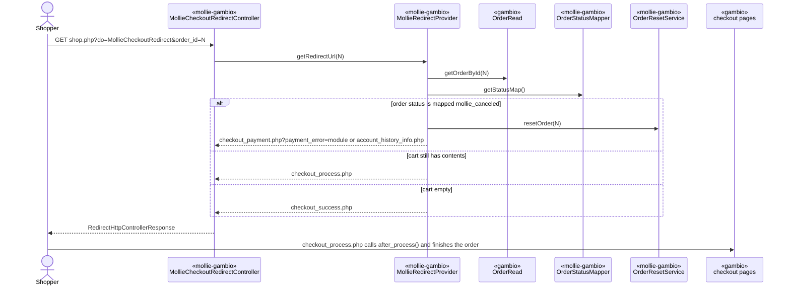
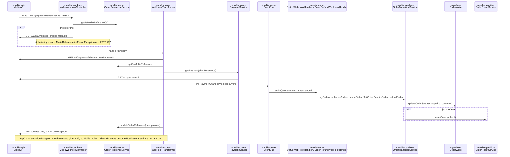
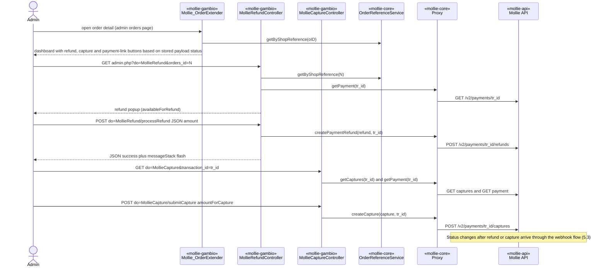
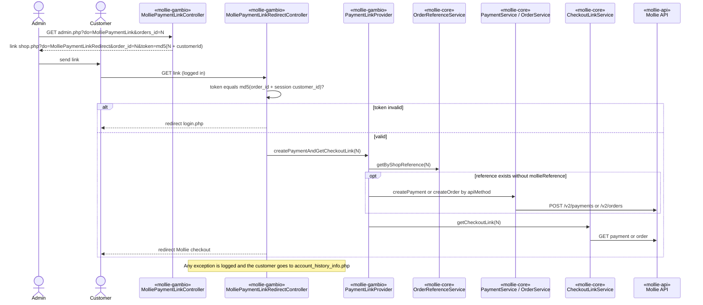
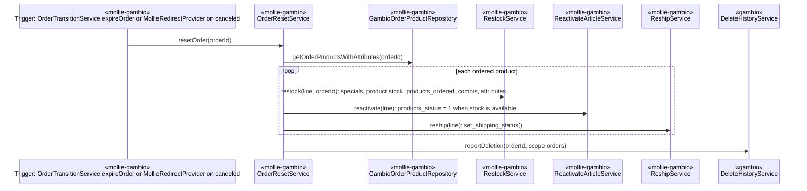
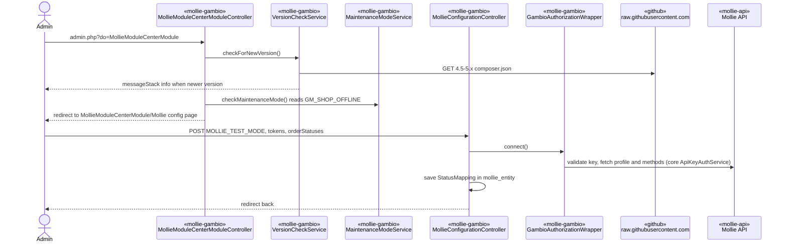

# DESIGN.md — Mollie module for Gambio

Living architecture record. Describes the system **as it is** on branch `4.5-5.x` (GX 4.5–5.0). Branch `4.1-4.4` (GX 4.1–4.4) has the same architecture, components, flows and patterns; its differences are listed in §9 and in `CLAUDE.md` § Supported branches. Any architectural change updates
this file (including diagrams) in the same pass.

## 1. Purpose

This module lets a Gambio GX 4.5.x–5.0.x shop take payments through Mollie. It exposes 23 Mollie payment methods as Gambio payment modules (`includes/modules/payment/mollie_*.php`), plus one optional surcharge order-total module (`ot_mollie`). A Module Center module handles API-key connection, order-status mapping and notifications. Order-detail extenders add a Mollie dashboard with refund, capture and payment-link actions. Payment state comes back through a shop webhook and a checkout redirect controller. Business logic (API proxy, payment/order services, webhook dispatch, ORM, notifications, surcharge, version check) lives in the vendored `mollie/integration-core` library. This module is the Gambio wrapper that implements the core's integration interfaces and maps Gambio orders to Mollie DTOs.

## 2. Architecture overview

The design has four layers, and dependencies point downward:

1. **Gambio entry points.** Payment and order-total modules (`includes/modules/`), GXModules HTTP controllers (Shop and Admin), and Gambio overload extenders. These are thin adapters invoked by Gambio. The module deliberately keeps the classic Gambio module structure (`includes/modules/payment` + `GXModules`) so that one codebase supports multiple Gambio versions.
2. **Wrapper components** (`Mollie\Gambio\*` under `GXModules/Mollie/Mollie/Components`). These are the Bootstrap, processors, mappers, the Gambio implementations of core interfaces, order reset, providers and repositories.
3. **Shared core** (`vendor/mollie/integration-core`). It contains `ServiceRegister`, `Proxy`, `PaymentService`, `OrderService`, `WebHookTransformer`, `EventBus`, `NotificationHub`, the ORM and `Configuration`.
4. **External systems and Gambio persistence.** These are the Mollie API, Mollie.js, the GitHub raw version file, and the Gambio DB (`gx_configurations`, `mollie_entity`, Gambio order/product tables).

The core calls back into the wrapper only through registered interfaces:
- `OrderTransitionService`
- `OrderLineTransitionService`
- `Configuration`
- `ShopLoggerAdapter`
- `RepositoryInterface`
- `PaymentTransactionDescriptionService`
- `VersionCheckService`
- `MaintenanceModeService`

All Mollie HTTP goes through the core's own `Proxy`/`BaseProxy` with `CurlHttpClient`. The `mollie/mollie-api-php` SDK is not used.

## 3. Key components

| Component | Responsibility | Collaborators |
|---|---|---|
| `BootstrapComponent` (`Components/BootstrapComponent.php`) | Composition root. It extends the core `BootstrapComponent` and registers the Gambio implementations of `ShopLoggerAdapter`, `AuthorizationService` (`ApiKeyAuthService`), `ProxyDataProvider`, `Configuration`, `HttpClient` (`CurlHttpClient`), `PaymentMethodService`, `OrderTransitionService`, `OrderLineTransitionService`, `PaymentTransactionDescriptionService`, `VersionCheckService` and `MaintenanceModeService`. It maps `ConfigEntity`, `PaymentMethodConfig`, `Notification`, `StatusMapping`, `OrderReference` and `CustomerReference` to `BaseRepository`, and registers `PaymentProcessor` for both `payments_api` and `orders_api`. | `autoload.php` (calls `BootstrapComponent::init()` on every include), core `ServiceRegister`, `RepositoryRegistry` |
| `mollie` base payment module (`includes/modules/payment/mollie/mollie.php`) | Implements the Gambio payment-module contract (`selection`, `process_button`, `payment_action`, `after_process`, `get_error`, `install`/`remove`/`keys`/`check`). It filters availability by Mollie-enabled methods (`Proxy::getEnabledPaymentMethodsMap`) and by allowed zones, shows the surcharge, and runs `PaymentMethodUpdate::upsertConfigFields()` in the constructor. `tmpOrders = true` makes Gambio create the order before `payment_action`. | `ProcessorFactory`, `Proxy`, `SurchargeService`, `ConfigurationService`, `GambioConfigRepository`, `MollieModuleChecker` |
| `mollie_issuer_providable` + `mollie_ideal`, `mollie_kbc`, `mollie_giftcard` | Issuer-list rendering and selection. The selected issuer goes into `$_SESSION['mollie_issuer']`. | `MollieIssuersProvider` |
| `mollie_creditcard` | Mollie Components card token (`$_SESSION['mollie_card_token']`) and single-click payments. Single-click creates a Mollie customer through `CustomerService` and stores `CustomerReference`. | `CustomerService`, `CustomerReferenceService`, `Shop/Html/mollie_credit_card.html` |
| `ot_mollie` (`includes/modules/order_total/ot_mollie.php`) | Adds the per-method surcharge (with its tax class) to `$order->info['total']`. | `SurchargeService` |
| `APIProcessor` (`ProcessorFactory`, `ProcessorRegister`, `PaymentProcessor`, `Result`) | Resolves the processor from the method's `PaymentMethodConfig::getApiMethod()`. `PaymentProcessor::create()` maps the order, calls `PaymentService::createPayment`, sets `mollie_created` and returns the checkout URL, or the `MollieCheckoutRedirect` URL when there is no checkout link. | `OrderMapper`, core `PaymentService`, `StatusUpdate` trait |
| `Mappers` (`OrderMapper`, `OrderTotalMapper`, `MapperUtility`, `OrderStatusMapper`) | Gambio `OrderInterface` → Mollie `Payment` or `Order` DTOs: lines, totals, gross/net tax handling, a "Tax adjustment" reconciliation line, addresses, locale, expiry, and issuer/card-token/customer from the session. `OrderStatusMapper` merges the saved `StatusMapping` with the default status IDs (`MOLLIE_DEFAULT_ORDER_STATUSES_MAP`); canceled and failed default to status `99`. | `OrderRead` service, `ConfigurationService`, `TransactionDescriptionService`, `RepositoryRegistry` |
| `Services\Business\OrderTransitionService` | The core's callback on status change. `payOrder`/`completeOrder` → `mollie_paid`, `authorizeOrder` → `mollie_authorized`, `refundOrder` → `mollie_refunded`. `cancelOrder` and `failOrder` → `mollie_canceled` with a comment. `expireOrder` → `mollie_canceled` plus `OrderResetService::resetOrder`. | `StatusUpdate` (Gambio `OrderWrite::updateOrderStatus`), `OrderResetService`, `MollieTranslator` |
| `Services\Business\OrderLineTransitionService` | Line-level callbacks. Cancel and refund push a `NotificationHub` info; the rest do nothing. | `NotificationHub` |
| `ConfigurationService` | Core `Configuration` implementation. It supplies the webhook URL (`shop.php?do=MollieWebhook`), the extension version from `composer.json`, the GX version from `release_info.php`, the version-check URL, and live/test key storage. | core `Configuration` (persists to `mollie_entity`), `UrlProvider` |
| `PaymentMethodService` | Builds `PaymentMethodConfig` from `gx_configurations` (`configuration/MODULE_PAYMENT_MOLLIE_*`) and defined constants. It always sets `API_METHOD_PAYMENT`. | `GambioConfigRepository` |
| `MaintenanceModeService`, `VersionCheckService`, `TransactionDescriptionService`, `LoggerService` | Gambio-specific hooks for core abstract services: `GM_SHOP_OFFLINE` via `LegacyDependencyContainer`, `messageStack` flash messages, per-language description constants, and `FileLog('mollie')`. | Gambio `messageStack`, `LanguageTextManager`, `FileLog` |
| `MollieRedirectProvider` | After the Mollie redirect: if the order status equals mapped `mollie_canceled`, it resets the order and sends the shopper to `checkout_payment.php?payment_error=…` (or `account_history_info.php`). Otherwise it sends the shopper to `checkout_process.php` (cart not empty) or `checkout_success.php`. | `OrderRead`, `OrderStatusMapper`, `OrderResetService` |
| `PaymentLinkProvider` | Creates a payment (or an Orders API order when `OrderReference.apiMethod` is `orders_api`) if the reference has no Mollie id yet, then returns `CheckoutLinkService::getCheckoutLink`. | `OrderReferenceService`, `PaymentService`, `OrderService`, `CheckoutLinkService`, `OrderMapper` |
| `OrderReset` (`OrderResetService`, `RestockService`, `ReactivateArticleService`, `ReshipService`) | Undoes stock effects of a failed or expired order: product/attribute/combi stock, specials quantity, `products_ordered`, product status and shipping status. It then reports the deletion to `DeleteHistoryService`. | `Gambio*Repository`, Gambio `ProductStockService`, `PropertiesCombisAdminControl`, `set_shipping_status()` |
| `Entity\Repository\BaseRepository` | Core `RepositoryInterface` over the single table `mollie_entity` (`type`, `index_1..7`, JSON `data`), using the CodeIgniter query builder. | `StaticGXCoreLoader::getDatabaseQueryBuilder()` |
| `Gambio*Repository` (`GambioBaseRepository` subclasses) | Raw-table access to `gx_configurations`, `orders_status`, `orders_products`, products, attributes, properties combis, specials, languages and countries. | CodeIgniter query builder |
| `GambioAuthorizationWrapper` | Validates and connects live/test API keys, stores them, and flashes the enabled methods. | `ApiKeyAuthService`, `PaymentMethodService`, `ConfigurationService` |
| `CustomFields` (`CustomFieldsProviderFactory` + providers) | Renders the Mollie-specific config fields (logo, multi-language names, API select, zones, surcharge, capture option, issuer list, components) inside Gambio's payment-module config page. | `mollie_config_fields.php` helpers, `Admin/Html/ConfigFields/*` |
| `MollieModuleCenterModule` | Install: creates `mollie_entity` and its indexes, creates four order statuses (Created/Paid/Authorized/Refunded (Mollie)), and stores `MOLLIE_DEFAULT_ORDER_STATUSES_MAP`. Uninstall: drops `mollie_entity`. | `GambioStatusRepository`, `GambioConfigRepository` |
| Admin controllers (`Admin/Classes/Controller/*`) | Module Center page (version check plus maintenance check on open), config save, key verification, notifications paging, refund/capture/payment-link popups, debug info, and logo upload. | core `Proxy`, `OrderReferenceService`, `NotificationChannelAdapter`, `DebugService` |
| Overload extenders (`Admin/Overloads/*`) | Hook Gambio admin actions: the order-detail dashboard (`Mollie_OrderExtender`), address/shipping/payment-type changes (`Mollie_OrderWriteServiceExtender`), order-line and total edits (`Mollie_AdminApplicationTopExtender`), cancel notifications (`Mollie_OrderActionExtender`), and custom config fields (`Mollie_ConfigurationBoxContentView`). | core `EventBus` (`Integration*Event`), `NotificationHub`, `OrderReferenceService` |

## 4. Domain model

Every entity and participant in sections 4 and 5 is labelled with the system that owns it:

| Label | Owner |
|---|---|
| `«gambio»` | The Gambio shop system (tables, services, checkout pages) |
| `«mollie-gambio»` | This module's own code (`GXModules/Mollie/Mollie`, `includes/modules`) |
| `«mollie-core»` | The vendored shared core `mollie/integration-core` |
| `«mollie-api»` | The external Mollie API (sequence diagrams only) |
| `«github»` | GitHub raw file host used for the version check (sequence diagrams only) |

Class diagrams put the label inside the class as an annotation (`<<gambio>>`). In sequence diagrams
the label is the first line of the participant alias, followed by ` ` and the name, with no
quotes: `participant GX as «gambio» checkout_process.php`. New diagrams, including those in
plans, follow the same convention.

`StatusMapping` (and the non-persisted `Result`) belong to this module. The `«mollie-core»` entities are defined by the core and persisted by this module's `BaseRepository` into `mollie_entity`. `MolliePayment` is the core's DTO of the Mollie API payment resource. `«gambio»` records are read or written through Gambio services and repositories.

Persistence summary:
- `mollie_entity` holds `ConfigEntity`, `PaymentMethodConfig`, `Notification`, `StatusMapping`, `OrderReference` and `CustomerReference`. They are discriminated by `type` and have up to 7 string indexes.
- `gx_configurations` holds per-method settings (`configuration/MODULE_PAYMENT_MOLLIE_<ID>_*`), `configuration/MOLLIE_DEFAULT_ORDER_STATUSES_MAP`, `configuration/MODULE_ORDER_TOTAL_MOLLIE_*` and `MODULE_CENTER_MOLLIE_INSTALLED`.
- Gambio tables (`orders`, `orders_status`, `products*`, `specials`) are written for status updates, new statuses and order reset.

## 5. Key flows

### 5.1 Checkout: payment creation

### 5.2 Redirect return

### 5.3 Webhook status update

### 5.4 Admin refund and capture

### 5.5 Payment link

The `OrderReference` without a `mollieReference` is created by `Mollie_OrderWriteServiceExtender::updatePaymentType` when an admin switches an order to a Mollie method.

### 5.6 Order reset on failure or expiry

The webhook `cancelOrder` and `failOrder` paths only set `mollie_canceled`. The reset for those happens when the shopper returns through `MollieRedirectProvider`. `expireOrder` resets directly.

### 5.7 Connect and version check (admin)

## 6. Module map

| Path | Responsibility | Key entry points |
|---|---|---|
| `includes/modules/payment/` | Gambio payment modules, one class per Mollie method: alma, applepay, bancontact, banktransfer, belfius, billie, creditcard, eps, giftcard, ideal, kbc, klarna, klarnapaylater, klarnapaynow, klarnasliceit, paypal, przelewy24, riverty, sofort, trustly, twint, wero. | `mollie/mollie.php` (base class `mollie`), `mollie/mollie_issuer_providable.php`, `mollie_creditcard.php`, `mollie_klarna.php` / `mollie_billie.php` / `mollie_alma.php` (hide `API_METHOD`) |
| `includes/modules/order_total/` | Mollie surcharge order total | `ot_mollie.php` |
| `lang/<language>/` | Language constants for payment and order-total modules (dutch, english, french, german, italian, spanish) | `modules/payment/mollie_*.php`, `modules/order_total/mollie.php`, `original_sections/modules/order_total/ot_mollie.lang.inc.php` |
| `images/icons/payment/` | Default method logos (`mollie_<id>.png`); `images/mollie_connect.png` | referenced by `mollie::_getMethodLogo()` |
| `GXModules/Mollie/Mollie/autoload.php` | Loads the vendor autoloader and calls `BootstrapComponent::init()` | required by every entry point |
| `GXModules/Mollie/Mollie/composer.json` | Package `mollie/gambio` 3.1.5, PSR-4 `Mollie\Gambio\` → `Components`; version source for `getExtensionVersion()` and the remote version check | — |
| `GXModules/Mollie/Mollie/mollie_config_fields.php` | Global helper functions for Gambio config field rendering (`mollie_switcher`, `mollie_api_select`, `mollie_capture_select`, `mollie_multi_select_countries`, `mollie_logo_upload`, …) and `mollie_render_template()` (Smarty `ContentView`) | included by payment modules and extenders |
| `GXModules/Mollie/Mollie/Components/` | Wrapper PHP code (`Mollie\Gambio\*`) | `BootstrapComponent.php`, `APIProcessor/`, `Mappers/`, `Services/Business/`, `Services/Infrastructure/LoggerService.php`, `OrderReset/`, `MollieRedirect/`, `PaymentLink/`, `Entity/`, `CustomFields/`, `Authorization/`, `Utility/`, `Debug/`, `Update/v2_0_8/PaymentMethodUpdate.php`, `Exceptions/` |
| `GXModules/Mollie/Mollie/Shop/Classes/Controller/` | Storefront HTTP controllers (`shop.php?do=…`) | `MollieWebhookController`, `MollieCheckoutRedirectController`, `MolliePaymentLinkRedirectController` |
| `GXModules/Mollie/Mollie/Shop/{Html,Javascripts,Styles,Templates,Themes}` | Checkout UI: issuer list, credit-card Components, Apple Pay. Template/theme overrides inject scripts including `https://js.mollie.com/v1/mollie.js`. | `Themes/All/checkout_payment_modules.html`, `Templates/All/module/checkout_payment_block.html` |
| `GXModules/Mollie/Mollie/Admin/Classes/` | Module Center module and admin controllers (`admin.php?do=…`) | `MollieModuleCenterModule.inc.php`, `Controller/MollieModuleCenterModuleController`, `MollieConfigurationController`, `MollieConnectController`, `MollieRefundController`, `MollieCaptureController`, `MolliePaymentLinkController`, `MollieNotificationController`, `MollieSupportController`, `MollieFileUploadController` |
| `GXModules/Mollie/Mollie/Admin/Overloads/` | Gambio class overloads (folder = overloaded class) | `OrderExtenderComponent/Mollie_OrderExtender`, `OrderWriteService/Mollie_OrderWriteServiceExtender`, `AdminApplicationTopExtenderComponent/Mollie_AdminApplicationTopExtender`, `OrderActions/Mollie_OrderActionExtender`, `ConfigurationBoxContentView/Mollie_ConfigurationBoxContentView` |
| `GXModules/Mollie/Mollie/Admin/{Html,Javascripts,Styles,TextPhrases}` | Admin templates (config page, order dashboard, popups), JS (fetch wrappers, modals), and `module_center_module` / `admin_orders` phrase sections in 6 languages | `Html/mollie_configuration.html`, `Html/OrderDashboard/*` |
| `GXModules/Mollie/Mollie/vendor/` | Committed Composer output: `mollie/integration-core` 1.3.10 plus the Composer autoloader | `vendor/mollie/integration-core/src/{BusinessLogic,Infrastructure}` |
| `.github/workflows/codeql.yml` | CodeQL scan (JavaScript only) on push/PR to `4.5-5.x` and weekly | — |

## 7. Key patterns & conventions

- **Composition root and service locator — the preferred way to resolve dependencies.** `autoload.php` calls `BootstrapComponent::init()`, which registers the wrapper implementations into the core `ServiceRegister`, maps entities to `BaseRepository` via `RepositoryRegistry`, and sets up `ProcessorRegister`. `BootstrapComponent::init()` + `ServiceRegister::getService(X::CLASS_NAME)` is the main and preferred way to resolve dependencies: register new services in `BootstrapComponent` and resolve them from `ServiceRegister`. Avoid instantiating services directly with `new`. Existing code still does this in places (`OrderResetService`, `MollieTranslator`, `Gambio*Repository`, and singletons via `getInstance()`); new code should not follow that pattern.
- **Core boundary interfaces.** The core calls the shop only through `Integration\Interfaces\OrderTransitionService` / `OrderLineTransitionService`, `Configuration`, `ShopLoggerAdapter`, `RepositoryInterface`, and the abstract `VersionCheckService` / `MaintenanceModeService` / `PaymentTransactionDescriptionService`. Admin-side shop changes go to the core as `Integration*Event` objects on `EventBus`, fired by the overload extenders. Webhook-side changes come back as `PaymentChangedWebHookEvent` / `OrderChangedWebHookEvent` and are handled by the core handlers. `WebHookContext` suppresses integration-event handlers while a webhook is running, so there is no echo back to Mollie.
- **Persistence.**
  - Core entities go into one generic table, `mollie_entity` (`type` + `index_1..7` + JSON `data`), created in `MollieModuleCenterModule::install()` and dropped on uninstall. There are no migrations; the schema is fixed.
  - Payment-method settings use Gambio's config table `gx_configurations` with keys `configuration/MODULE_PAYMENT_<CODE>_<FIELD>`, read back as PHP constants (`defined()`/`constant()`).
  - Missing fields are upserted at runtime by `PaymentMethodUpdate` (constructor of every payment module), by `mollie_issuer_providable` / `mollie_creditcard` (initial `ISSUER_LIST`, `COMPONENTS_STATUS`, `SINGLE_CLICK_STATUS`), and by `ot_mollie` (sort-order type).
  - Direct SQL must use the CodeIgniter query builder (`StaticGXCoreLoader::getDatabaseQueryBuilder()`). Avoid `xtc_db_query` wherever possible; use it only where Gambio itself dictates it (existing uses: `mollie.php`, `ot_mollie.php`, `MollieModuleChecker`).
- **Gambio overload/extender mechanism.** A class `Mollie_<X>` extends the generated `Mollie_<X>_parent`, placed under `Admin/Overloads/<OverloadedClass>/`. Gambio's `MainFactory` chains it into the original class, so each method calls `parent::…` to keep the chain working. Payment modules end with `MainFactory::load_origin_class('mollie')`. GXModules controllers are discovered by convention: `<Name>Controller` extends `HttpViewController` (shop) or `AdminHttpViewController` (admin), with `action<Name>()` methods, and returns `MainFactory::create('…HttpControllerResponse', …)`.
- **Naming.**
  - Gambio payment code is `mollie_<mollieMethodId>`; the Mollie method id is the code minus the `mollie_` prefix (`MapperUtility::_formatPaymentMethod`).
  - Mollie status keys are `mollie_created|paid|authorized|refunded|canceled|failed`.
  - Underscore-prefixed method names (`_getX`) are used throughout.
  - Wrapper classes are `Mollie\Gambio\<Area>\<Name>`; Gambio-visible classes are global and `.inc.php`.
- **Session as the transport between checkout steps.** `mollie_issuer`, `mollie_card_token`, `mollie_customer_id` and `<code>_error` are written in `process_button()` / `payment_action()` and consumed once in `MapperUtility::addSpecificParameters()` / `get_error()`.
- **API selection.** `ProcessorRegister` accepts `payments_api` and `orders_api` but maps both to `PaymentProcessor`. `PaymentMethodService::extractLocalConfiguration` always returns `payments_api`, so checkout always uses the Payments API (release 3.1.0, "Remove usage of Orders API"). Capture is offered only for `mollie_billie`, `mollie_creditcard`, `mollie_klarna` and `mollie_riverty` payments in status `authorized` (`Mollie_OrderExtender::$capturableMethods`). Orders API code paths remain for older `OrderReference` records created with the Orders API (`Mollie_OrderExtender`, `MollieCaptureController::_handleOrderTransaction`, `MollieRefundController::getTransactionId`, `PaymentLinkProvider`).
- **Error surfacing.** Admin actions catch `Exception` and flash through `$GLOBALS['messageStack']`. Core-side problems become `NotificationHub` entries, shown in the Module Center notifications tab. Logging goes to Gambio `FileLog('mollie')`, filtered by `minLogLevel` or debug mode.

## 8. External boundaries

| Boundary | Direction | Details |
|---|---|---|
| Mollie API v2 (`https://api.mollie.com/v2/`; reference: https://docs.mollie.com/reference/overview) | outbound | Through core `Proxy` + `CurlHttpClient`, bearer API key from `ConfigEntity`. Calls: `GET methods` (enabled/all methods on every checkout page and admin page), `POST payments`, `GET payments/{id}`, `POST payments/{id}/refunds`, `GET/POST payments/{id}/captures`, `POST customers` (single-click), `GET orders/{id}` and `POST orders` (older Orders API references only), and key validation / profile lookup on connect. |
| Mollie webhook → `shop.php?do=MollieWebhook` | inbound | Form POST with `id`. There is no signature; authenticity comes from fetching the resource back from the API by id. One webhook makes up to 3 `GET /payments/{id}` calls (`_getOrderReferenceFromPayment` fallback, `determineRequestId`, `PaymentService::getPayment`). It replies 422 on a missing reference, on any exception, or on core-rethrown `HttpCommunicationException`, so Mollie retries. |
| Mollie hosted checkout → `shop.php?do=MollieCheckoutRedirect&order_id=N` | inbound (browser) | `redirectUrl` in the payment. It is not authenticated, reads only the order status and session cart, and may run order reset. |
| Payment link → `shop.php?do=MolliePaymentLinkRedirect&order_id=N&token=…` | inbound (browser) | Token is `md5(order_id . customer_id)`, checked against the session customer. |
| Mollie Components JS (`https://js.mollie.com/v1/mollie.js`) | browser | Card tokenisation (profile id, test mode, locale), loaded by the checkout template overrides. |
| Version check (`https://raw.githubusercontent.com/mollie/gambio/4.5-5.x/GXModules/Mollie/Mollie/composer.json`) | outbound | Through `VersionCheckProxy` on every open of the Module Center entry action. Download link: `https://github.com/mollie/gambio/releases/tag/v<version>`. |
| Gambio core services | in-process | `StaticGXCoreLoader::getService('OrderRead'|'OrderWrite'|'OrderStatus')`, `DeleteHistoryServiceFactory`, `LegacyDependencyContainer` (`Gambio\Core\Configuration\ConfigurationService`), `LanguageTextManager`, `messageStack`, `FileLog`, `ContentView`, and the `xtc_*` functions. |

## 9. Known constraints

- **PHP floor.**
  - `composer.json` declares `"php": ">=5.4"`; the core declares `>=5.3`.
  - Wrapper code uses PHP 5.4 features (short arrays, traits, `static function` closures) and nothing newer (no `??`, no scalar or return type declarations).
  - The code must also run on PHP 8.x (3.0.18 added PHP 8.2 compatibility). Guard every constant lookup with `defined()`, because an undefined `constant()` throws on PHP 8 (3.1.5).
- **Gambio range.** This branch (`4.5-5.x`) supports GX 4.5.x–5.0.x. The only other actively maintained line is GX 4.1.x–4.4.x on branch `4.1-4.4`; fixes that apply there are ported by hand. All other branches and GX versions are out of scope. The code relies on GX 4.x APIs (`LegacyDependencyContainer`, `gx_configurations` with the `configuration/` key prefix, the CodeIgniter query builder).
- **Branch differences (`4.1-4.4`).** These are the same layers and flows, with branch-specific details:
  - `gx_configurations` rows are inserted with `legacy_group_id = 6`.
  - Constants are read with `@constant(...)`, with no `_getConstantValue()` helper.
  - `PaymentMethodUpdate::addConfigFields()` has no sort-order type update.
  - `Mollie_AdminApplicationTopExtender::proceed(): void`.
  - Languages are de/en/fr/nl only.
  - `VERSION_CHECK_URL` and the CodeQL workflow point at `4.1-4.4`.
  - The vendored core files differ from this branch (`ProxyDataProvider`, `PaymentMethodConfig`).
- **Vendored core.** `vendor/` is committed. `mollie/integration-core` comes from a private VCS repo (`git@github.com:mollie/orocore.git`), so `composer install` needs access to it. The core is never edited in place.
- **Single store.** `getCurrentSystemId()` returns `'1'`; there is no store scoping.
- **Manual verification.** There is no automated test suite or quality gate. Changes are verified on a Gambio install (copy files, clear the module/output/text cache, install via Module Center).
